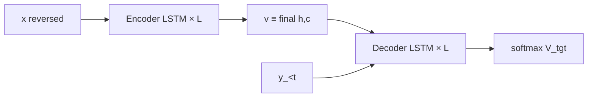

# Architecture

[Sutskever, Vinyals, Le 2014](https://arxiv.org/abs/1409.3215) — seq2seq MT without attention.
Code: `src/seq2seq/`. Config scale: [configs.md](configs.md).

## Model

Separate deep LSTMs for source and target (§2). Encoder maps a (reversed) source to a
fixed vector \(v\); the decoder is an LM conditioned on \(v\):

\[
p(y_1,\ldots,y_{T'}\mid x)=\prod_{t=1}^{T'} p(y_t\mid v,\,y_{<t}).
\]



**This repo:** initialise **all** decoder layers from the encoder’s final \((h,c)\).
No attention — one vector summarises the whole source.

## Source reversal (§2, §3.3)

Encoder reads tokens right-to-left; targets stay left-to-right. Shortens the path between
aligned early words; large long-sentence BLEU effect in the paper.

```
EN:  the cat sat on the mat
ENC: mat the on sat cat the  →  v
DEC: <sos> … FR … <eos>
```

## LSTM cell (Graves)

`lstm_cell.py` — gates packed `[i|f|g|o]`:

\[
\begin{aligned}
i_t&=\sigma(W_{xi}x_t+W_{hi}h_{t-1}+b_i),&
f_t&=\sigma(W_{xf}x_t+W_{hf}h_{t-1}+b_f),\\
g_t&=\tanh(W_{xg}x_t+W_{hg}h_{t-1}+b_g),&
o_t&=\sigma(W_{xo}x_t+W_{ho}h_{t-1}+b_o),\\
c_t&=f_t\odot c_{t-1}+i_t\odot g_t,&
h_t&=o_t\odot\tanh(c_t).
\end{aligned}
\]

Deep stack (`deep_lstm.py`): layer \(\ell\) input is \(h^{(\ell-1)}_t\) (embeddings at \(\ell=0\)).

## Training (§3.4)

Teacher forcing; mean NLL on non-pad target tokens.

| | Paper |
|--|--------|
| Init | \(\mathrm{Unif}[-0.08,0.08]\) |
| Optim | SGD, no momentum; batch-averaged grads |
| LR | \(0.7\); hold 5 ep; then ×½ every 0.5 ep; 7.5 ep total |
| Clip | \(\|g\|_2>5 \Rightarrow g\leftarrow 5g/\|g\|_2\) |
| Batch | 128, length-bucketed |

`toy` / `mid` keep this *recipe*, smaller sizes / fewer epochs ([configs.md](configs.md)).

## Decoding (§3.2)

Left-to-right beam search; beam 2 ≈ most of the gain vs greedy. Full-vocab softmax each step
(no sampled / class-factored softmax here).

## Not in this replica

Attention (Bahdanau 2015); 8-GPU layer parallel; softmax shard; 5-model ensemble;
SMT rescoring; claiming paper BLEU.
